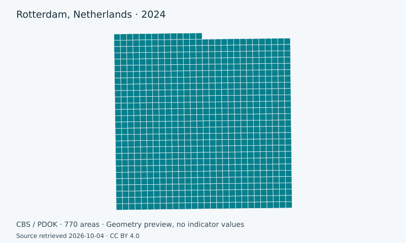

# Open data. Clear spatial questions.

Explore maps, compare scenarios and share results. Each project keeps its sources, calculations and publication files together in GitHub.

[Explore projects](projects.md){ .md-button .md-button--primary }
[Create with ChatGPT](workflow.md){ .md-button }

## Explore the projects

-   ### Utrecht: ageing and density

    

    Examine where a high share of residents aged 65+ coincides with population density. Open the map, dashboard or globe-to-neighbourhood flyover.

    [Explore Utrecht](projects/utrecht-65plus-density.md){ .md-button }

-   ### Rotterdam: investment priorities

    

    Compare policy scenarios on the official CBS 500 metre statistical grid. Inspect the indicators, weights and underlying sources.

    [Explore Rotterdam](projects/rotterdam-investment-priority.md){ .md-button }

## From question to published project

1. Describe your question in ChatGPT, including the place, year and desired outputs.
2. Review the sources, calculation and proposed result in GitHub.
3. Open the published project page to explore, share or export the result.

[See the workflow](workflow.md){ .md-button }

## Choose the result you need

| Your task | Project output |
| --- | --- |
| Explore a spatial pattern | Interactive map |
| Compare values or scenarios | Dashboard |
| Follow the explanation | Story map |
| Present the result | Print layout, atlas or video |
| Reuse the analysis | Data export and SQL |

Each project lists its available outputs. Browser exports are prepared on your device. Published files open directly.

Built on [upstream GeoLibre](https://github.com/opengeos/GeoLibre). This fork adds repository-based research projects and publication pages. [Technical documentation](documentation.md) · [Privacy](privacy.md) · [Terms](terms.md)
