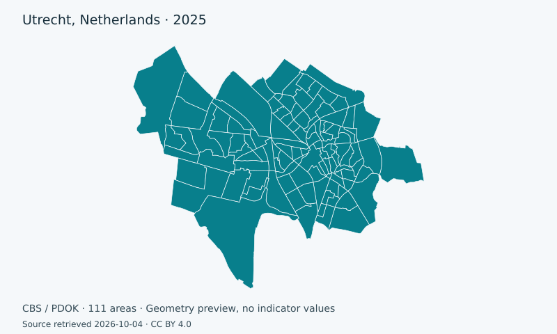

# Projects

Public, reproducible spatial research projects authored in this repository.

Each project stores its GeoLibre workspace, SQL, source provenance, and documentation together in Git.

<section class="project-card" data-title="Rotterdam Investment Priority Lab" data-region="Rotterdam, Netherlands" data-topics="investment-priority|scenario-analysis|demography|income|accessibility|social-policy" data-outputs="interactive-map|viewer|dashboard|storymap|print-layout|atlas|dataset|standalone-html|video" data-updated="2026-10-04" markdown>
## Rotterdam Investment Priority Lab

Compares policy investment priorities across Rotterdam's urban core on the official CBS 500 metre statistical grid.

- Location: Rotterdam, Netherlands
- Topics: investment-priority, scenario-analysis, demography, income, accessibility, social-policy
- Outputs: interactive-map, viewer, dashboard, storymap, print-layout, atlas, dataset, standalone-html, video
- Updated: 2026-10-04

[Open project page](projects/rotterdam-investment-priority.md){ .md-button .md-button--primary }
[Open map](https://equilibriumpress.github.io/geolibre-projects/demo/?layout=viewer&returnTo=..%2Fprojects%2Frotterdam-investment-priority%2F&availableOutputs=map%2Cdashboard%2Cstory%2Cprint%2Catlas%2Cdata%2Cvideo&toolbar=none&url=https%3A%2F%2Fraw.githubusercontent.com%2FEquilibriumpress%2Fgeolibre-projects%2F1111111111111111111111111111111111111111%2Fprojects%2Frotterdam-investment-priority%2Fproject.geolibre&output=map){ .md-button }
</section>

<section class="project-card" data-title="Ageing and population density in Utrecht" data-region="Utrecht, Netherlands" data-topics="ageing|population|density|neighbourhoods" data-outputs="interactive-map|viewer|dashboard|print-layout|dataset|video" data-updated="2026-10-04" markdown>
## Ageing and population density in Utrecht

Explores Utrecht neighbourhoods that combine a high share of residents aged 65+ with high population density.

- Location: Utrecht, Netherlands
- Topics: ageing, population, density, neighbourhoods
- Outputs: interactive-map, viewer, dashboard, print-layout, dataset, video
- Updated: 2026-10-04

[Open project page](projects/utrecht-65plus-density.md){ .md-button .md-button--primary }
[Open map](https://equilibriumpress.github.io/geolibre-projects/demo/?layout=viewer&returnTo=..%2Fprojects%2Futrecht-65plus-density%2F&availableOutputs=map%2Cvideo%2Cdashboard%2Cprint%2Cdata&toolbar=none&url=https%3A%2F%2Fraw.githubusercontent.com%2FEquilibriumpress%2Fgeolibre-projects%2F1111111111111111111111111111111111111111%2Fprojects%2Futrecht-65plus-density%2Fproject.geolibre&output=map){ .md-button }
</section>

<section class="project-card" data-title="Population density in Utrecht" data-region="Utrecht, Netherlands" data-topics="population|density|neighbourhoods" data-outputs="interactive-map|dashboard|dataset" data-updated="2026-10-04" markdown>
## Population density in Utrecht

Compare residents per square kilometre across Utrecht neighbourhoods using one transparent indicator.

- Location: Utrecht, Netherlands
- Topics: population, density, neighbourhoods
- Outputs: interactive-map, dashboard, dataset
- Updated: 2026-10-04

[Open project page](projects/utrecht-population-density.md){ .md-button .md-button--primary }
[Open map](https://equilibriumpress.github.io/geolibre-projects/demo/?layout=viewer&returnTo=..%2Fprojects%2Futrecht-population-density%2F&availableOutputs=map%2Cdashboard%2Cdata&toolbar=none&url=https%3A%2F%2Fraw.githubusercontent.com%2FEquilibriumpress%2Fgeolibre-projects%2F1111111111111111111111111111111111111111%2Fprojects%2Futrecht-population-density%2Fproject.geolibre&output=map){ .md-button }
</section>

